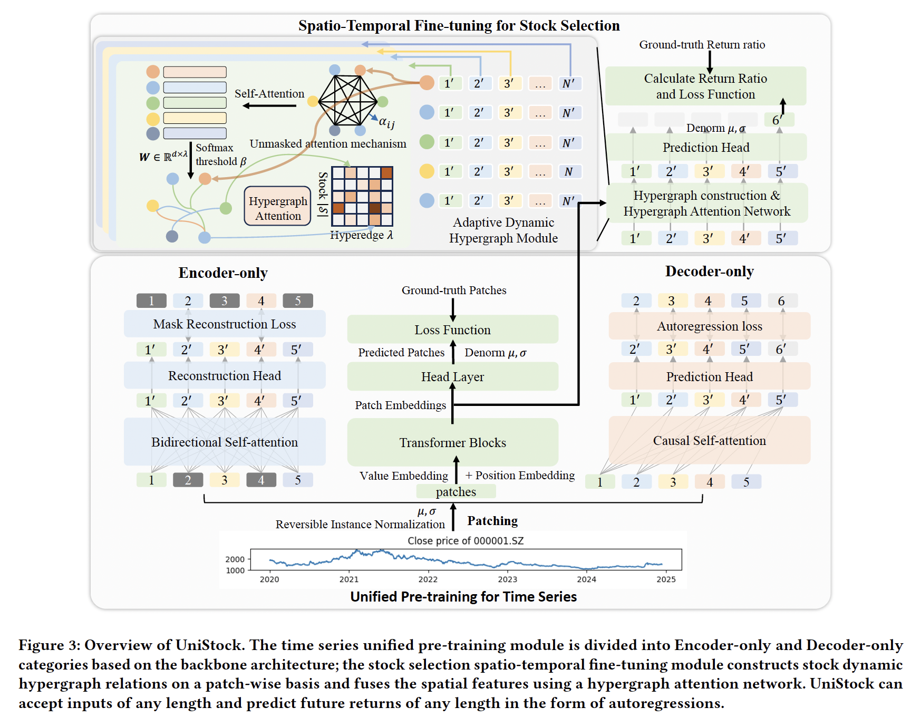

# UniStock: A Unified Framework for Stock Selection based on Spatio-Temporal Dynamic Modeling



Quantitative stock selection can be categorized as a spatio-temporal modeling research, which contains two major modules of time-series feature extraction and stock relationship modeling. Existing researches are task-specific methods, i.e., the proposed methods are only applicable to a specific dataset, and the length of their model inputs, prediction period, and relationship modeling methodology are fixed, while in recent years, we witnessed that the foundation models have demonstrated a powerful generalization ability in various fields of artificial intelligence. Therefore, we propose UniStock, a unified framework for quantitative stock selection, which consists of a Decoder-only or Encoder-only time series unified pretraining module and a dynamic hypergraph attention network-based spatio-temporal fine-tuning module. The former enables the model to have powerful temporal feature extraction capability and arbitrary input/output length adaptation by performing unified pre-training on large-scale multi-domain time series datasets and the latter constructs dynamic hypergraph relations among stocks and fine-tuning the model prediction head for quantitative stock selection, which improves the model's prediction capability and allows for dynamic relation construction for any given stock pools. We have compiled a large-scale stock dataset containing data on all stocks in the A-share market since 1991 and the S&P500 since 1961, and we have conducted a large number of qualitative and quantitative experiments on these two datasets, which on the one hand validate UniStock's zero-shot capability as a generalized quantitative stock selection model, and on the other hand validate the Spatio-temporal fine-tuning method we proposed makes UniStock outperform existing SOTA methods.

## Install environment

Init environment using conda

```
conda create -n unistock python=3.11.11

conda activate unistock
```

Install required packages:

```
pip3 install -r requirements.txt
```

## Datasets & model

### datasets
Stock datasets: [Link](https://pan.baidu.com/s/1Uvz0JQyOhgMccoTGfllO1Q) Code: kr5a


Pre-train datasets: 
+ UTSD [Link](https://cloud.tsinghua.edu.cn/f/93868e3a9fb144fe9719/)
+ Stock [Link](https://pan.baidu.com/s/16v7TIhTD6VSnWzyl94Iq-A) Code: gs23


### models

+ UniStock pre-train model: [Link](https://pan.baidu.com/s/1EjwQgimnojIJV4Lxny0AQA) Code: thu1

+ UniStock(E) pre-train model: [Link](https://pan.baidu.com/s/1fVpiMmhTFJcASQvQdsW7WA) Code: r9g5


## Notes

+ Before running the program, be sure to check the path of the dataset and the model checkpoints in the code!!!


## Zero-shot

```
bash scripts/Timer/zeroshot/A_share.sh
```

## Fine-tune

```
bash scripts/Timer/finetune/A_share_graph.sh
```

## Pre-train

```
bash scripts/Timer/pretrain/A_Share.sh
```